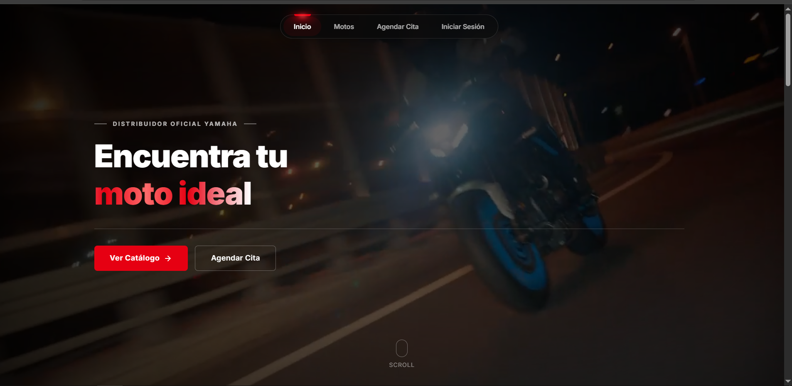
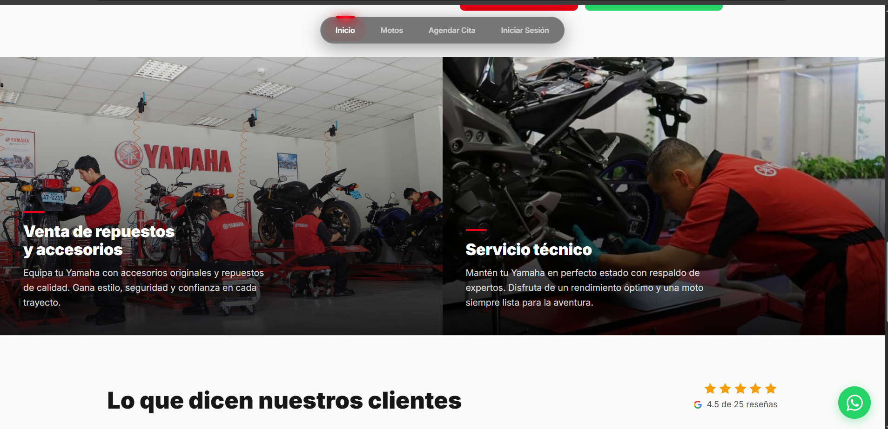

# Yamaha Motos - Plataforma Web de Catalogo, Pedidos y Citas

Aplicacion full stack para un concesionario Yamaha. El proyecto integra un backend en Django + Django REST Framework con un frontend en React (Vite), permitiendo consultar motos, registrar clientes, gestionar pedidos y agendar citas de servicio o asesoria.

## Integrantes

- Camilo Sanchez Salinas
- Yessetk Rodriguez Quintero
- Andres Felipe Lozano

## Vista General

Este repositorio implementa una arquitectura desacoplada:

- Backend: API REST versionada en `/api/v1/`.
- Frontend: SPA en React con rutas de cliente y consumo de API.
- Integracion: Django sirve el build de React en produccion y expone estaticos/media.

## Galeria del Proyecto

<table>
	<tr>
		<td width="50%" valign="top">
			
			<p align="center"><strong>Landing principal</strong></p>
		</td>
		<td width="50%" valign="top">
			
			<p align="center"><strong>Servicios y experiencia de cliente</strong></p>
		</td>
	</tr>
</table>

## Modulos Funcionales

- Catalogo de motos con detalle por modelo.
- Registro e inicio de sesion de clientes.
- Agendamiento y gestion de citas.
- Gestion de pedidos y estados.
- Frontend SPA con navegacion fluida y enfoque comercial.

## Stack Tecnologico

### Backend

- Python 3.12
- Django
- Django REST Framework
- Pillow
- SQLite (entorno local)

### Frontend

- React 18
- Vite 5
- React Router DOM
- Framer Motion
- Lucide React

### Infraestructura

- Docker
- Docker Compose

## Arquitectura del Proyecto

```text
Cliente (React SPA)
				|
				v
API REST /api/v1/ (Django + DRF)
				|
				v
Modelos y servicios de dominio (motos app)
				|
				v
SQLite + almacenamiento media/static
```

## Endpoints Principales

Base URL API: `/api/v1/`

### Motos

- `GET /motos/`
- `GET /motos/{id}/`

### Clientes

- `POST /clientes/`
- `POST /clientes/login/`
- `GET /clientes/{id}/`

### Pedidos

- `GET /pedidos/`
- `POST /pedidos/`
- `GET /pedidos/{id}/`
- `PATCH /pedidos/{id}/estado/`
- `GET /pedidos/{id}/factura/`

### Citas

- `GET /citas/`
- `POST /citas/`
- `GET /citas/{id}/`
- `PATCH /citas/{id}/confirmar/`
- `PATCH /citas/{id}/cancelar/`

## Estructura de Carpetas

```text
motos-yamaha/
|- motos/                  # App principal Django (modelos, API, servicios)
|- yamaha_shop/            # Configuracion global de Django
|- fixtures/               # Datos iniciales
|- media/                  # Imagenes de motos
|- static/                 # Recursos estaticos y build de React
|- templates/              # Plantillas fallback
|- frontend/               # Aplicacion React + Vite
|  |- src/
|  |  |- components/
|  |  |- pages/
|  |  |- services/
|  |  |- context/
|- Dockerfile
|- docker-compose.yml
|- requirements.txt
```

## Ejecucion Local

### 1. Clonar repositorio

```bash
git clone <URL_DEL_REPOSITORIO>
cd motos-yamaha
```

### 2. Backend Django

```bash
python -m venv .venv
# Windows
.venv\Scripts\activate
# Linux/Mac
source .venv/bin/activate

pip install -r requirements.txt
python manage.py migrate
python manage.py loaddata fixtures/initial_data.json --ignorenonexistent
python manage.py runserver
```

Servidor backend: `http://127.0.0.1:8000`

### 3. Frontend React

```bash
cd frontend
npm install
npm run dev
```

Servidor frontend: `http://localhost:5173`

## Ejecucion con Docker

```bash
docker compose up --build
```

Aplicacion disponible en: `http://localhost:8000`

## Configurar Mercado Pago Real (no simulado)

El proyecto viene en modo demo por defecto para poder probar el flujo sin credenciales.

### 1. Crear archivo de entorno

```bash
# Linux/macOS
cp .env.example .env

# Windows CMD
copy .env.example .env
```

### 2. Configurar variables en `.env`

```env
MERCADOPAGO_ACCESS_TOKEN=TEST-xxxxxxxxxxxxxxxx
PAYMENTS_FRONTEND_BASE_URL=http://localhost:5173
PAYMENTS_DEMO_MODE=0
```

- `PAYMENTS_DEMO_MODE=1`: usa pasarela simulada (`/pasarela-demo`).
- `PAYMENTS_DEMO_MODE=0`: usa API real de Mercado Pago.

### 3. Reiniciar servicios

```bash
docker compose down
docker compose up --build
```

### 4. Validar que esta en real

- Inicia una compra desde `Checkout`.
- Si abre una pantalla interna `/pasarela-demo`, sigue en modo demo.
- Si redirige a `mercadopago.com`, ya esta usando Mercado Pago real.

## Integracion Frontend + Backend

- En desarrollo, Vite utiliza proxy para `/api` y `/media` hacia `localhost:8000`.
- En produccion, React se compila en `static/react` y Django lo sirve mediante ruta catch-all.

## Modelos de Dominio

- `Moto`: informacion comercial y tecnica del catalogo.
- `Cliente`: datos de contacto e identificacion.
- `Pedido`: transaccion con estado, subtotal, IVA y total.
- `Cita`: agenda comercial o tecnica asociada a cliente y moto.

## Estado del Proyecto

El proyecto se encuentra funcional para:

- Exploracion de catalogo
- Registro/login de clientes
- Agendamiento de citas
- Flujo base de pedidos

## Licencia

Uso academico y demostrativo.
